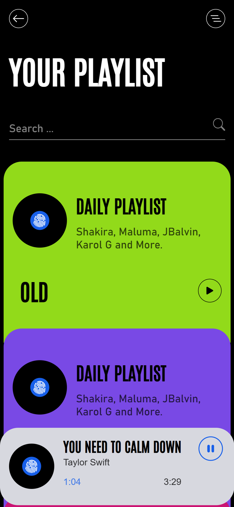

# Code

this is just a bunch of code (mostly js) not important enough for separate repos

### BSP

App based in the code of user [bryc](https://github.com/bryc/code), React + Vite
this is a synth player I've been working for a while now. It uses the Web Audio
API to generate music.

The best that can be done are simple ON/OFF sounds with some LFO modulation,
and extremely simple white noise percussion (with a fixed 1 step length).
I archived BSP2 in the 'old-code' section which contains some ideas for further
enhancement (with better LFO control over parameters), but to me it's almost
not worth pursuing if I can't do percussion sounds.

So this project is kinda on hold until I can figure out more flexible ways
to implement the sequencer timer, and rewrite the code.

#### Screenshot

    

### Sudoku

App based in the code of user [bryc](https://github.com/bryc/code), React + Vite
has been added to project for render the board, the logic of creation and validation
has been moved for using custom hooks.

A Sudoku app is a digital platform designed specifically for playing Sudoku,
a popular puzzle game that requires players to fill in a 9x9 grid with the
numbers 1-9, ensuring that each row, column, and 3x3 sub-grid contains all
of the numbers without repetition.

#### Screenshot

Based in the concept of Sudoku App of [Andrii Chernysh](https://dribbble.com/shots/16990994-Concept-for-Sudoku-App)