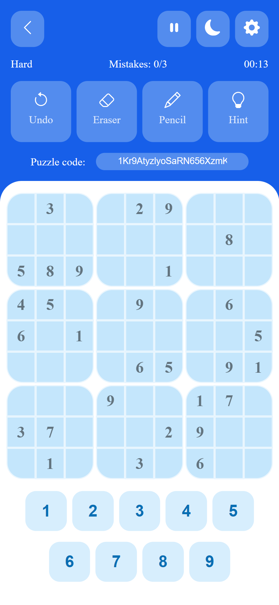

# Sudoku

A Sudoku app is a digital platform designed specifically for playing Sudoku,
a popular puzzle game that requires players to fill in a 9x9 grid with the
numbers 1-9, ensuring that each row, column, and 3x3 sub-grid contains all
of the numbers without repetition.

A Sudoku app typically allows users to choose from various levels of
difficulty, ranging from easy to hard or even expert. It provides a clean,
user-friendly interface for inputting numbers and allows players to undo or
redo moves as necessary. It also includes features such as auto-checking the
correctness of the current solution and the option to highlight duplicates.

Additionally, some Sudoku apps come with a game solver feature, which can
provide hints to the player or solve the game entirely. Some apps also allow
users to create their own puzzles using a built-in generator, which can then
be shared with others.

Overall, a Sudoku app is a convenient and portable way to enjoy this classic
puzzle game. It provides players with hours of entertainment and is perfect
for anyone who enjoys a good mental challenge.

